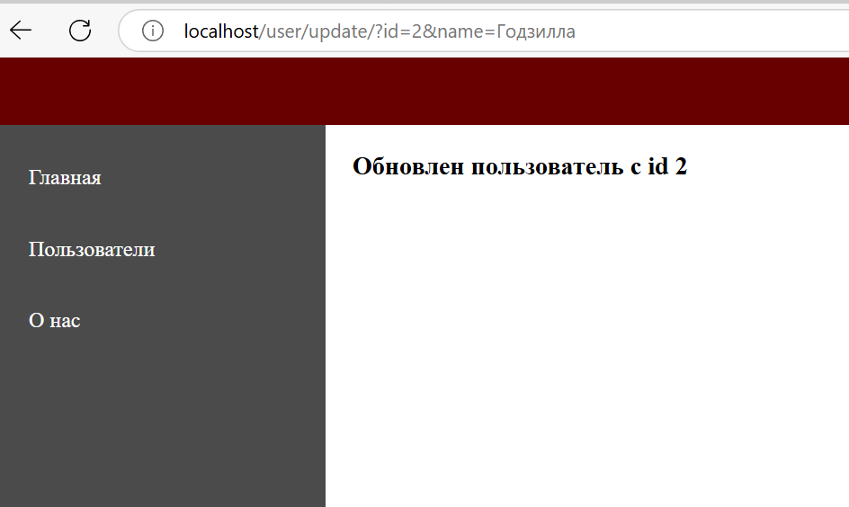
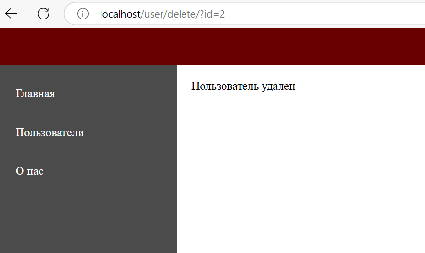
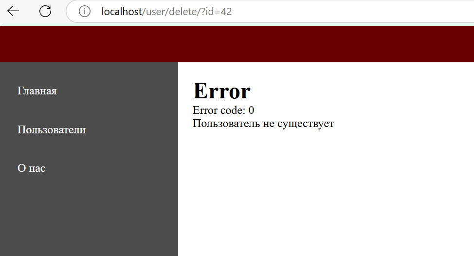

# Домашняя работа
1. Мы стали работать с исключениями. Создайте в Render логику обработки исключений так, чтобы она встраивалась в общий шаблон. 
 
```
public static function renderExceptionPage(Exception $exception): string {
        $contentTemplateName = "page-error.twig"; 
    
        if ($exception->getCode() === 404) {
            $contentTemplateName = "page-not-found.twig"; 
        }
    
        $viewFolder = '/src/Domain/Views/';
        $loader = new FilesystemLoader($_SERVER['DOCUMENT_ROOT'] . $viewFolder);
        $environment = new Environment($loader, [
            // 'cache' => $_SERVER['DOCUMENT_ROOT'].'/cache/',
        ]);
    
        $template = $environment->load('main.twig');
    
        $templateVariables = [
            'content_template_name' => $contentTemplateName,
            'error_message' => $exception->getMessage(),
            'error_code' => $exception->getCode(),
        ];
    
        return $template->render($templateVariables);
    }
```
В класс Render добавили метод renderExceptionPage который отвечает за отображение страницы ошибки. Если исключение имеет код 404, будет отображена страница page-not-found.twig, если код ошибки другой — страница page-error.twig. 

2. Создайте метод обновления пользователя новыми данными. Например,

/user/update/?id=42&name=Петр

Такой вызов обновит имя у пользователя с ID 42. Обратите внимание, что остальные поля не меняются. Также помните, что пользователя с ID 42 может и не быть в базе.

— Создайте метод удаления пользователя из базы. Учитывайте, что пользователя может не быть в базе
/user/delete/?id=42



